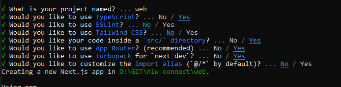

### nlw-connect - 2025

---

#### Getting Started

######  Preparação
```sh
1. [NodeJS](https://nodejs.org/pt/) 
2. [VSCode](https://code.visualstudio.com/) 
3. extensões
    3.1 Omni Theme
    3.2 symbols
    3.3 Tailwind CSS IntelliSense
```

######  Iniciando Projeto
```sh
1. [NextJS](https://nextjs.org/) 
2. npx create-next-app@latest --empty

3. cd web
4. npm run dev
5. [Localhost](http://localhost:3000)
```
######  Instalando tailwindcss
```sh
1. [tailwindcss](https://tailwindcss.com/docs/installation/framework-guides/nextjs) 
2. npm install tailwindcss @tailwindcss/postcss postcss
3. criar arquivo `postcss.config.mjs` na raiz do projeto
4. criar arquivo `globals.css` na pasta src\app
5. importar dentro do arquivo layout.tsx `import './globals.css'`
```

#### About

developed by [Calazans](https://rcalazansn.azurewebsites.net)  


